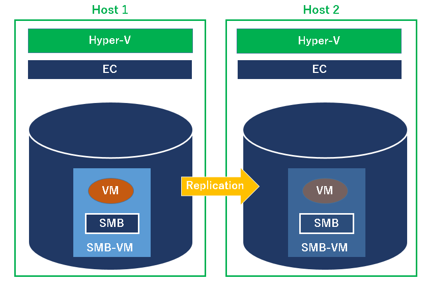

# Live Migration solution with SMB **(Note: This content is incomplete and under investigation.)**

Configuring VM Live Migration in Hyper-V host cluster with SMB.

## Architecture

- ECX is installed on host servers, and ECX replicates the disk that contains SMB VM.
	- Hyper-V VMs are created on the SMB VM.
- ECX protects VMs on Hyper-V, means start / stop / monitor and realizing failover of VMs across Hyper-V boxes.

	

## Network

- Separating network for VM / management of VM and cluster / mirroring / iSCSI / Live Migration.

	\<being edited\>

## Setting up 2-node WSFC clutser

## Setting up Hyper-V network

## Setting up iSCSI target VM (EC-VM1 and EC-VM2 in the diagram)

## Connecting to iSCSI target from host servers by iSCSI initiator

## Configuring CSV

## Creating a protected VM in CSV

## Adding script resources to control VMs and live migration
