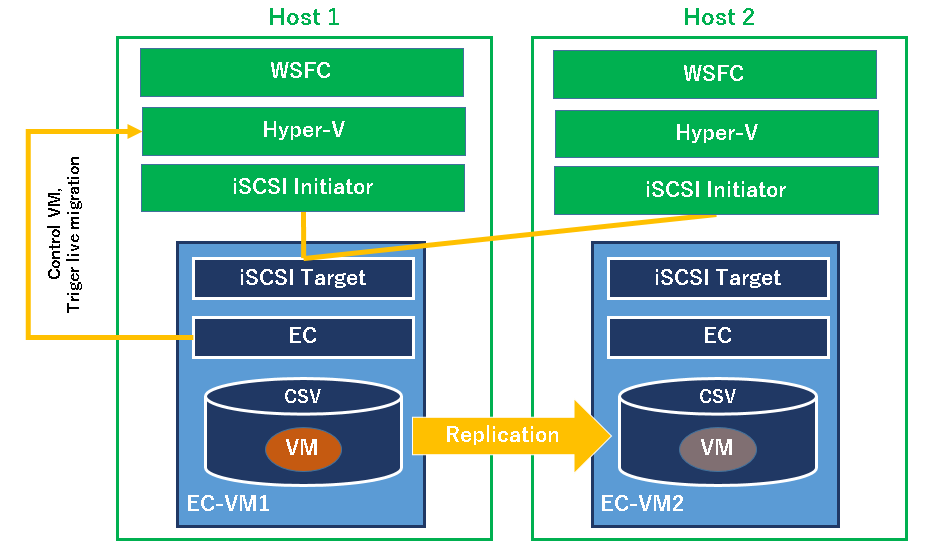
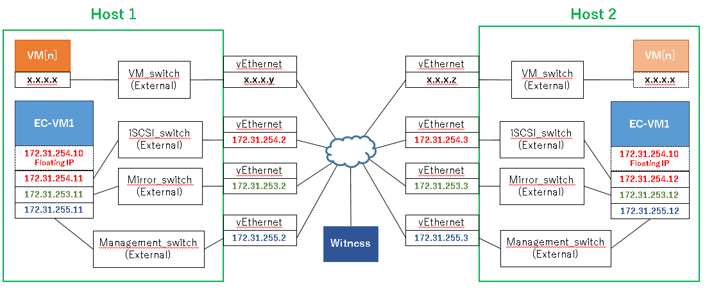

# Live Migration solution with WSFC **(Note: This content is incomplete and under investigation.)**

Configuring VM Live Migration in Hyper-V host cluster with WSFC.

## Architecture

- ECX is installed on VMs where iSCSI target service is running, and ECX replicates the disk configured as iSCSI target.
	- Hyper-V VMs are created on the iSCSI target disk.
	- ECX data mirroring provides a virtual shared disk for WSFC.
	- WSFC uses the virtual shared disk as Cluster Shared Volume (CSV).
- ECX protects VMs on Hyper-V, means start / stop / monitor and realizing failover of VMs across Hyper-V boxes.

	

## Network

- Separating network for VM / management of VM and cluster / mirroring / iSCSI / Live Migration.
- One server is needed outside a WSFC cluster, for ECX witness and WSFC quorum disk. Ideally this server should also be clustered, but currently this document describes a configuration with two WSFC servers and one quorum disk.

	

## Host servers' spec

- Windows Server 2019 Datacenter (Desktop Experience)
- 4 CPU
- 9GB RAM
- 4 NICs
- 2 HDDs, 40GB for OS and 60GB for EC-VM

## Setup procedure
### Installing Hyper-V

Open **Server Manager** and click **Add roles and features**.
- Check **Hyper-V** as **Server Roles**
- Create one virtual switch for external access
- Check **Allow this server to send and receive live migrations of virtual machines**
	- Select **Use Credential Security Support Provider (CredSSP)**
- VM's default location can be configured anywhere in the host machine, but it is better to save VMs to another disk for easy maintenance.

After completing Hyper-V installation, configure Hyper-V settings.
- Create Virtual Switches
	- Management_switch was created during Hyper-V installation.
	- Mirror_switch (External) should be created newly.
	- iSCSI_switch (External) should be created newly.
	- VM_switch (External) should be created newly.
- Live Migration Settings
	- Check **Enable incoming and outgoing migrations**

----

### Host server settings

- Open network adapter settings and set IP address to each vEthernet.
- Join servers to a domain and configure a firewall of the domain.
- Login to the domain account.

Subsequent procedures should be operated by the domain account.

----

### Installing WSFC

Open **Server Manager** and click **Add roles and features**.
- Check **Failover Clustering** as **Features**

----

### Configuring WSFC

First, open **Failover Cluster Manager** and create a WSFC cluster.

Once created a cluster, in **Networks** setting, disable networks other than Management_network and Mirror_network.
- Right-click network name and open the property.
	- Select **Do not allow cluster network communication on this network**

----

### Setting up iSCSI target VM (EC-VM1 and EC-VM2 in the diagram)

Open **Hyper-V Manager** and create a new VM.

After creating EC-VMs, change the VM settings as follows:
- **Automatic Start Action**: **Always start this virtual machine automatically**
- **Startup delay**: 5 seconds

#### EC-VM's spec
- CentOS Linux release 8.2.2004 (Core)
- EXPRESSCLUSTER X 4.3.0-1
- 1 CPU
- 4GB RAM
- 3 NICs
- 2 HDDs, 30GB for OS and 25GB for mirror disk

Once OS installation finished, do as follows.
1. Disable firewalld
	```
	# systemctl disable firewalld
	```
1. Disable dnf-cache.timer
	```
	# systemctl disable dnf-makecache.timer
	```
1. Disable SELinux
	```
	# sed -i -e 's/^SELINUX=.*/SELINUX=disabled/' /etc/selinux/config
	```
1. Network settings
	- Configure IP addresses, gateway, DNS, proxy
1. Install iSCSI **targetcli**, **unzip**, **tar** and **perl** with yum command

	```
	# yum -y install targetcli unzip tar
	```
1. Disable and stop iSCSI target

	```
	# systemctl disable target
	# systemctl stop target
	```
1. Configure a disk for ECX mirror disk
	1. Create partitions for ECX cluster partition and ECX data partition.
		
		e.g. In case of using /dev/sdb for ECX mirror disk.
		```
		# parted -s /dev/sdb mklabel msdos mkpart primary 0% 1025MiB mkpart primary 1025MiB 100%
		```
1. Configure a symbolic link of the disk device

	On Linux machine, names of disk devices may change sometimes because Linux OS determines device names in the order in which they are recognized.

	By creating a symbolic link of the disk device, you can use an unique name even if the device name were changed.

	1. Check disk IDs

		e.g. In case of using /dev/sdb for ECX mirror disk.
		```
		# /lib/udev/scsi_id --whitelisted --device=/dev/sdb
		3600224804fb4d824c64c0f4156f86fc9
		```
	1. Create a rule file for a symbolic link

		e.g.
		```
		# vi /etc/udev/rules.d/99-clusterpro-devices.rules
		KERNEL=="sd*[^0-9]",ENV{ID_SERIAL}=="",IMPORT{program}="/lib/udev/scsi_id --whitelisted --device=/dev/%k"
		KERNEL=="sd*[^0-9]",ENV{ID_SERIAL}=="",IMPORT{parent}=="ID_*"
		ENV{ID_SERIAL}=="3600224804fb4d824c64c0f4156f86fc9",SYMLINK+="cp-diska%n"
		```
		You need to edit only *3600224804fb4d824c64c0f4156f86fc9* depending on your environment.

1. Install ECX
1. Reboot OS
1. Confirm that the symbolic link is enabled.
	```
	# ls -l /dev/cp-*
	lrwxrwxrwx 1 root root 3 Feb 16 15:42 /dev/cp-diska -> sdc
	lrwxrwxrwx 1 root root 4 Feb 16 17:24 /dev/cp-diska1 -> sdc1
	lrwxrwxrwx 1 root root 4 Feb 16 17:04 /dev/cp-diska2 -> sdc2
	```
1. Once you complete the above steps on both VMs, create a ECX cluster

At this point, required ECX resources are
- Witness heartbeat
- LAN heartbeat
- HTTP NP
- Floating IP address
	- Should belong to the network connecting to iSCSI_switch
- Mirror disk
	- Data Partition Device Name: /dev/cp-diska2
	- Cluster Partition Device Name: /dev/cp-diska1
	- File System: none
- Exec
	- e.g. Resource name is *exec-iscsi*
	- Should depend on a Floating IP address and Mirror disk
		- Add Floating IP address and Mirror disk in **Dependency** tab.
	- Replace scripts with new scripts below.

		*start.sh*
		```
		#!/bin/sh -eu
		echo "Starting iSCSI Target"
		systemctl start target
		echo "Started  iSCSI Target ($?)"
		exit 0
		```
		*stop.sh*
		```
		#!/bin/sh -eu
		echo "Stopping iSCSI Target"
		systemctl stop target
		echo "Stopped  iSCSI Target ($?)"
		exit 0
		```

----

### Configuring iSCSI target

1. Confirm that a failover group is running on EC-VM1
1. Configure NMP1 as a target disk

	```
	systemctl start target
	targetcli /backstores/block create name=idisk1 dev=/dev/NMP1

	# Creating IQN
	targetcli /iscsi create iqn.1996-10.com.ecx

	# Assigning LUN to IQN
	targetcli /iscsi/iqn.1996-10.com.ecx/tpg1/luns create /backstores/block/idisk1

	# Allow Host 1 and 2 (*IQN of iSCSI Initiator*) to scan the iSCSI target

	targetcli /iscsi/iqn.1996-10.com.ecx/tpg1/acls create $IQN1
	targetcli /iscsi/iqn.1996-10.com.ecx/tpg1/acls create $IQN2

	# Save the configuration
	targetcli saveconfig
	```

	You can check IQN on **iSCSI Initiator** Configuration tab on each host server.
1. Move a failover group to EC-VM2 and configure as same.
1. Move a failover group to EC-VM1

----

### Connecting to iSCSI target from host servers

1. Open **iSCSI Initiator**
1. In **Targets** tab, type the floating IP address and click **Quick Connect**
1. Select the target and click **Connect**

This disk will be configured as WSFC cluster shared volume from next steps.

----

### Configuring CSV

1. Open **Disk Management** on either host server
1. Configure the disk as NTFS
1. Open **Disk Management** on another host server, and make it online.
1. Open **Failover Cluster Manager**
1. In **Disks** page, add the disk and set it as cluster shared volume.

----

### Configuring quorum disk

A shared disk that is accessible from both hosts is needed outside host servers.

A quorum disk size should be larger than 512MB.
- https://docs.microsoft.com/en-us/windows-server/failover-clustering/manage-cluster-quorum

You can co-locate it with ECX witness server and configure it as iSCSI target.

1. Open **Disk Management** on either host server
1. Configure the disk as NTFS
1. Open **Disk Management** on another host server, and make it online.
1. Open **Failover Cluster Manager**
1. In **Disks** page, add the disk.
1. In cluster summary page, select **Configure Cluster Quorum Settings** in **More Actions**
1. **Select the quorum witness**
1. **Configure a disk witness**
1. Check the disk

----

### Creating a protected VM in CSV

In case you create a VM newly,
- In **Role** page, select **New Virtual Machine** in **Virtual Machines**

In case you import an existing VM,
- Import a VM on **Hyper-V Manager**
- In **Role** page, select **Configure Role**

----

### Configuring WSFC Live Migration

- In **Networks** page, select **Live Migration Settings**
- Uncheck networks other than VM_network

----

### Configuring WSFC settings to restrain WSFC recovery action

To prevent conflicts between recovery actions, WSFC recovery action needs to be disabled.

Checking a current quarantine configuration:
```
> get-cluster | Select Name,Resiliency*,Quarantine*

Name                    : ws2019-lm-cluster
ResiliencyDefaultPeriod : 240
ResiliencyLevel         : AlwaysIsolate
QuarantineDuration      : 7200
QuarantineThreshold     : 3
```

Changing a quarantine configuration:
```
> (Get-Cluster).ResiliencyDefaultPeriod = 9999
> (Get-Cluster).QuarantineThreshold = 9999
```

WSFC behavior after executing the above command:
- After WSFC detects another cluster node is isolated, WSFC wait 9999 seconds until it starts recovery action.
- WSFC quarantines a cluster node that has be turned off unintentionally 9999 times in a hour.

Disabling a VM failover function:
1. Open VM property on **Failover Cluster Manager**.
1. In **Failover** tab, change settings as follows.
	- **Maximum failures in the specified period**: 0
	- **Period (hours)**: 0
	- **Prevent failback**

----

### Configuring ssh settings

SSH setting is required to allow EC-VM to send commands to host servers.

On host servers,
1. Download OpenSSH-Win64.zip
	- https://github.com/PowerShell/Win32-OpenSSH/releases
1. Unzip the file and move OpenSSH-Win folder under *Program Files* folder
1. Execute **install-sshd.ps1**
1. Open **Service Manager**, start **Open SSH SSH Server** and change its startup type to **Automatic**

On EC-VMs,
1. Create ssh key pair

	```
	# yes no | ssh-keygen -t rsa -f /root/.ssh/id_rsa -N ""
	```
1. Copy the public key to host servers

	```
	# scp /root/.ssh/id_rsa.pub Administrator@<IP of host 1>:C:\\ProgramData/ssh/<EC-VM hostname>
	# scp /root/.ssh/id_rsa.pub Administrator@<IP of host 2>:C:\\ProgramData/ssh/<EC-VM hostname>
	```

On host servers,
1. Merge EC-VM's key files into **administrators_authorized_keys**.
	```
	> type C:\ProgramData\ssh\ec-vm1 C:\ProgramData\ssh\ec-vm2 > administrators_authorized_keys
	```
1. Add following lines to **sshd_config** in *C:\ProgramData\ssh*
	```
	PubkeyAuthentication yes
	PasswordAuthentication no
	PermitEmptyPasswords yes
	```
1. Edit file permission of **administrators_authorized_keys**
	- Open the property
	- Click **Advanced** in **Security** tab
	- Click **Disable inheritance**
	- Select **Convert inherited permissions into explicit permissions on this object**
	- Delete **Authenticated Users**
1. Restart **OpenSSH SSH Server**

After the above all steps, confirm that EC-VM1 and 2 can connect to both servers by ssh command without typing a password.

----

### Adding EXEC resources to control a VM and live migration

1. Downloading scripts from GitHub repository
1. Adding to a EXEC resource to control a VM
	- e.g. Resource name is *exec-VMNAME*
	- Depends on *exec-iscsi*
	- Replacing *start.sh* with *vm-start.pl*
	- Editing **Configuration** section in the start script.
	- Replacing *stop.sh* with *vm-unregister.pl*
	- Editing **Configuration** section in the stop script.
	- **Log Output Path** in **Tuning** page is */opt/nec/clusterpro/log/exec-VMNAME.log*
	- Checking *Rotate Log* in **Tuning** page
1. Applying the cluster configuration

----

### Adding custom monitor resource for a VM

One custom monitor resource is needed per VM, and one is needed per cluster.

1. Adding to a custom monitor resource to monitor a VM
	- e.g. Monitor name is *genw-VMNAME*
	- **Retry Count** is 1
	- Monitor timing is when *exec-VMNAME* is active
	- Replacing *genw.sh* with *genw-vm.pl*
	- Editing **Configuration** section in the monitor script
	- **Log Output Path** is */opt/nec/clusterpro/log/genw-VMNAME.log*
	- Checking **Rotate Log**
	- **Normal Return Value** is 0
	- **Recovery Action** is **Executing failover to the recovery target**
	- **Recovery Target** is the failover group that includes the VM
1. Adding to a custom monitor resource to monitor an opposite EC-VM
	- e.g. Monitor name is *genw-remote-node*
	- Monitor timing is when the md resource is active
	- Replacing *genw.sh* with *genw-remote-node.pl*
	- Editing **Configuration** section in the monitor script
	- **Log Output Path** is */opt/nec/clusterpro/log/genw-remote-node.log*
	- Checking **Rotate Log**
	- **Normal Return Value** is 0
	- **Recovery Action** is **Custom settings**
	- **Recovery Target** is **LocalServer**
	- **Final Action** is **No operation**

----

## How to operate a cluster

*exec-VMNAME*
- When it starts, VM is registered on Hyper-V Manager and powered on.
- When it stops, VM is unregistered on Hyper-V Manager and powered off.

*genw-VMNAME*
- Executing the recovery action if VM is not running on its host server.

*genw-remote-node*
- Starting ECX cluster if it is not running on the opposite EC-VM.
- Powering on the opposite EC-VM if it is not running.

How to execute Live Migration:
- In case that an user moves a failover group manually and a VM is running on a source server, Live Migration is executed without stopping the VM.

How to stop the VM to change its property:
- Suspend *genw-VMNAME*.
- Please note that VM should be powered on after changing its property and before resuming *genw-VMNAME*.

## Testing

Please refer to [Test items of Live Migration SL](Testing.md).