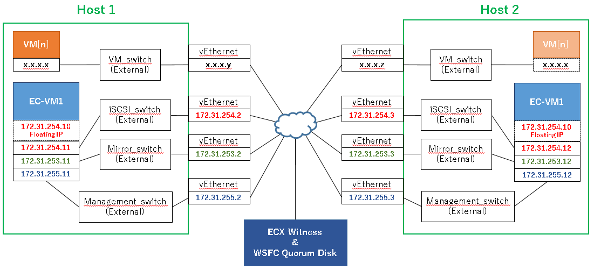

# Live Migration solution with WSFC **(Note: This content is incomplete and under investigation.)**

Configuring VM Live Migration in Hyper-V host cluster with WSFC.

## Architecture

- ECX is installed on VMs where iSCSI target service is running, and ECX replicates the disk configured as iSCSI target.
	- Hyper-V VMs are created on the iSCSI target disk.
	- ECX data mirroring provides a virtual shared disk for WSFC.
	- WSFC uses the virtual shared disk as Cluster Shared Volume (CSV).
- ECX protects VMs on Hyper-V, means start / stop / monitor and realizing failover of VMs across Hyper-V boxes.

	

## Network

- Separating network for VM / management of VM and cluster / mirroring / iSCSI / Live Migration.

	

## Host servers' spec

- Windows Server 2019 Datacenter (Desktop Experience)
- 4 CPU
- 9GB RAM
- 4 NICs
- 2 HDDs, 40GB for OS and 60GB for EC-VM

## Setup procedure
### Installing Hyper-V

Open **Server Manager** and click **Add roles and features**.
- Check **Hyper-V** as **Server Roles**
- Create one virtual switch for external access
- Check **Allow this server to send and receive live migrations of virtual machines**
	- Select **Use Credential Security Support Provider (CredSSP)** or **Use Kerberos**
		- (I need to find which one is the best.)
- VM's default location can be configured anywhere in the host machine, but it is better to save VMs to another disk for easy maintenance.

After completing Hyper-V installation, configure Hyper-V settings.
- Create Virtual Switches
	- Management_switch was created during Hyper-V installation.
	- Mirror_switch (External) should be created newly.
	- iSCSI_switch (External) should be created newly.
	- VM_switch (External) should be created newly.
- Live Migration Settings
	- Check **Enable incoming and outgoing migrations**

### Host server settings

- Open network adapter settings and set IP address to each vEthernet.
- Join servers to a domain and configure a firewall of the domain.
- Login to the domain account.

Subsequent procedures should be operated by the domain account.

### Installing WSFC

Open **Server Manager** and click **Add roles and features**.
- Check **Failover Clustering** as **Features**

### Configuring WSFC

First, open **Failover Cluster Manager** and create a WSFC cluster.

Once created a cluster, in **Networks** setting, disable networks other than Management_network and Mirror_network.
- Right-click network name and open the property.
	- Select **Do not allow cluster network communication on this network**

### Setting up iSCSI target VM (EC-VM1 and EC-VM2 in the diagram)

Open **Hyper-V Manager** and create a new VM.

#### EC-VM's spec
- CentOS Linux release 8.2.2004 (Core)
- EXPRESSCLUSTER X 4.3.0-1
- 1 CPU
- 4GB RAM
- 3 NICs
- 2 HDDs, 30GB for OS and 25GB for mirror disk

Once OS installation finished, do as follows.
1. Configure firewalld
1. Disable SELinux
1. Network settings
1. Install iSCSI target, unzip, tar with yum command

	```
	# yum -y install targetcli unzip tar
	```
1. Disable and stop iSCSI target

	```
	# systemctl disable target
	# systemctl stop target
	```
1. Install ECX
1. Create a ECX cluster

At this point, required ECX resources are
- Floating IP address
	- Should belong to the network connecting to iSCSI_switch
- Mirror disk
	- File system is none
- Exec

	*start.sh*
	```
	#!/bin/sh -eu
	echo "Starting iSCSI Target"
	systemctl start target
	echo "Started  iSCSI Target ($?)"
	exit 0
	```
	*stop.sh*
	```
	#!/bin/sh -eu
	echo "Stopping iSCSI Target"
	systemctl stop target
	echo "Stopped  iSCSI Target ($?)"
	exit 0
	```

### Coniguring iSCSI target

1. Confirm that a failover group is running on EC-VM1
1. Configure NMP1 as a target disk

	```
	systemctl start target
	targetcli /backstores/block create name=idisk1 dev=/dev/NMP1

	# Creating IQN
	targetcli /iscsi create iqn.1996-10.com.ecx

	# Assigning LUN to IQN
	targetcli /iscsi/iqn.1996-10.com.ecx/tpg1/luns create /backstores/block/idisk1

	# Allow Host 1 and 2 (*IQN of iSCSI Initiator*) to scan the iSCSI target

	targetcli /iscsi/iqn.1996-10.com.ecx/tpg1/acls create $IQN1
	targetcli /iscsi/iqn.1996-10.com.ecx/tpg1/acls create $IQN2
	```

	You can check IQN on **iSCSI Initiator** Configuration tab on each host server.
1. Move a failover group to EC-VM2 and configure as same.
1. Move a failover group to EC-VM1

### Connecting to iSCSI target from host servers

1. Open **iSCSI Initiator**
1. In **Targets** tab, type the floating IP address and click **Quick Connect**
1. Select the target and click **Connect**

This disk will be configured as WSFC cluster shared volume from next steps.

### Configuring CSV

1. Open **Disk Management** on either host server
1. Configure the disk as NTFS
1. Open **Disk Management** on another host server, and make it online.
1. Open **Failover Cluster Manager**
1. In **Disks** page, add the disk and set it as cluster shared volume.

### Configuring quorum disk

A shared disk that is accessible from both hosts is needed outside host servers.

You can colocate it with ECX witness server and configure it as iSCSI target.

1. Open **Disk Management** on either host server
1. Configure the disk as NTFS
1. Open **Disk Management** on another host server, and make it online.
1. Open **Failover Cluster Manager**
1. In **Disks** page, add the disk and set it as cluster shared volume.
1. In cluster summary page, select **Configure Cluster Quorum Settings** in **More Actions**
1. **Select the quorum witness**
1. **Configure a disk witness**
1. Check the disk

### Creating a protected VM in CSV

In case you create a VM newly,
- In **Role** page, select **New Virtual Machine** in **Virtual Machines**

In case you import an existing VM,
- Import a VM on **Hyper-V Manager**
- In **Role** page, select **Configure Role**

### Configuring WSFC Live Migration

- In **Networks** page, select **Live Migration Settings**
- Uncheck networks other than VM_network

### Configuring ssh settings

SSH setting is required to allow EC-VM to send commands to host servers.

On host servers,
1. Download OpenSSH-Win64.zip
	- https://github.com/PowerShell/Win32-OpenSSH/releases
1. Unzip the file and move OpenSSH-Win folder under *Program Files* folder
1. Execute **install-sshd.ps1**
1. Open **Service Manager**, start **Open SSH SSH Server** and change its startup type to **Automatic**

On EC-VMs,
1. Create ssh key pair

	```
	# yes no | ssh-keygen -t rsa -f /root/.ssh/id_rsa -N ""
	```
1. Copy the public key to host servers

	```
	# scp /root/.ssh/id_rsa.pub Administrator@<IP of host 1>:C:\\ProgramData/ssh/administrators_authorized_keys
	# scp /root/.ssh/id_rsa.pub Administrator@<IP of host 2>:C:\\ProgramData/ssh/administrators_authorized_keys
	```

On host servers,
1. Add following lines to **sshd_config** in *C:\ProgramData\ssh*
	```
	PubkeyAuthentication yes
	PasswordAuthentication no
	PermitEmptyPassword yes
	```
1. Edit file permission of **administrators_authorized_keys**
	- Open the property
	- Click **Advanced** in **Security** tab
	- Click **Disable inheritance**
	- Select **Convert inherited permissions into explicit permissions on this object**
	- Delete **Authenticated Users**
1. Restart **OpenSSH SSH Server**

After the above all steps, confirm that EC-VM1 and 2 can connect to both servers by ssh command without typing a password.

### Adding script resources to control VMs and live migration
